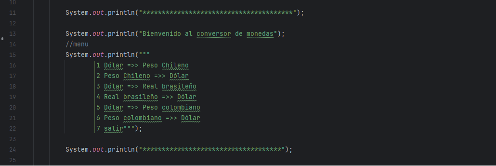
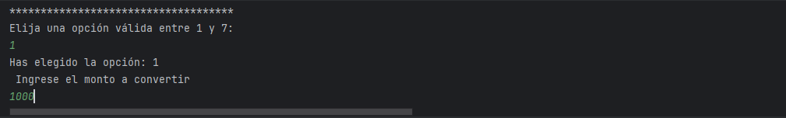
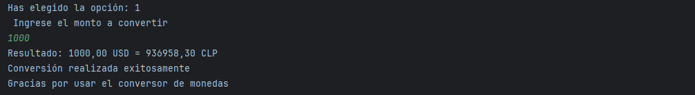

# 💱 Conversor de Monedas en Java

Este es un programa que permite convertir entre diferentes monedas utilizando una API en tiempo real. Funciona desde la consola y está desarrollado en Java.

---
## 📋 ¿Qué hace este programa?

- Muestra un menú con opciones de conversión entre monedas.
- Permite ingresar un monto y realiza la conversión usando tasas actualizadas desde una API.
- Muestra el resultado formateado con dos decimales.

---

## ▶️ Vista del Menú

Este es el menú principal que aparece cuando se ejecuta el programa:

---

## ✏️ Ingreso del monto

Luego de elegir una opción del menú, el programa solicita al usuario ingresar el monto que desea convertir.  
Este valor será usado junto a la tasa obtenida de la API para calcular el resultado.

---

## 📊 Resultado de la conversión

Una vez ingresado el monto, el programa realiza la conversión en tiempo real utilizando la tasa actual proporcionada por la API.  
El resultado se muestra en pantalla con dos decimales, seguido de un mensaje de confirmación.

